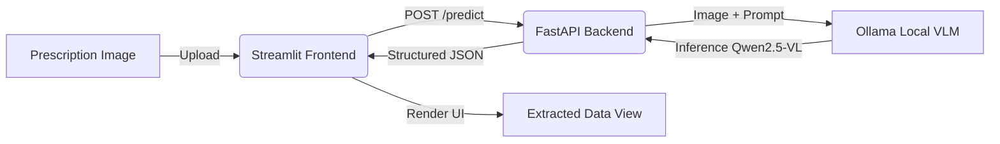

# 🏥 Medical Prescription Analyzer


> **An intelligent Vision-Language Model (VLM) pipeline designed to digitize, interpret, and structure handwritten medical prescriptions with high accuracy.**

## 📖 Overview

The **Medical Prescription Analyzer** solves a critical healthcare challenge: deciphering handwritten medical prescriptions. By leveraging state-of-the-art local Vision-Language Models, this tool seamlessly reads scanned or photographed prescriptions and extracts vital medicine data (such as dosage, duration, and frequency) into a structured JSON format. 

This project is tailored for pharmacists, healthcare providers, and patients to minimize medication errors and streamline digital health record keeping.

## ✨ Key Features
- **Accurate Handwriting Recognition:** Powered by Qwen2.5-VL via Ollama, capable of interpreting difficult clinical handwriting.
- **Structured Data Extraction:** Automatically parses unstructured images into standard JSON format with distinct fields for medicine name, dosage, quantity, frequency, route, and doctor's instructions.
- **FastAPI Backend:** A robust, asynchronous API layer for fast inference and easy integration with external services.
- **Streamlit Dashboard:** An intuitive, user-friendly frontend to upload prescriptions and view extracted data instantly.
- **Local & Secure:** Fully runs on local hardware using Ollama, ensuring that sensitive patient health information (PHI) never leaves your device.

---

## 🏗️ Architecture



---

## 🚀 Quick Start Guide

### Prerequisites
- Python 3.11 or higher
- [Ollama](https://ollama.com/) installed and running on your machine
- Pull the required VLM model using Ollama:
  ```bash
  ollama pull qwen2.5vl
  ```

### 1. Setup Environment
Clone the repository and install dependencies:
```bash
git clone https://github.com/DYNAMOatGHUB/Medical-Prescription-Analyzer.git
cd Medical-Prescription-Analyzer

# Create and activate virtual environment
python -m venv venv
# On Windows:
venv\Scripts\activate
# On Linux/Mac:
source venv/bin/activate

# Install requirements
pip install -r requirements.txt
```

### 2. Run the Application
The application consists of two components: the backend API and the frontend dashboard. Run them in separate terminals.

**Terminal 1 – Start the Backend Server:**
```bash
python -m uvicorn app.main:app --reload
```
*The API will be available at `http://localhost:8000` (Visit `http://localhost:8000/docs` for Swagger UI).*

**Terminal 2 – Start the Frontend Dashboard:**
```bash
python -m streamlit run frontend/streamlit_app.py
```
*The dashboard will automatically open in your default browser at `http://localhost:8501`.*

---

## 📂 Project Structure

```text
Medical-Prescription-Analyzer/
├── app/
│   ├── __init__.py
│   ├── config.py              # Environment and configuration settings
│   ├── main.py                # FastAPI routing and application entry point
│   └── pipeline/
│       ├── __init__.py
│       └── vlm_extractor.py   # Ollama integration and VLM prompt engineering
├── frontend/
│   └── streamlit_app.py       # Streamlit UI implementation
├── tests/
│   └── __init__.py
├── .env                       # Runtime configuration (VLM_MODEL, LOG_LEVEL)
├── requirements.txt           # Project dependencies
└── README.md                  # Project documentation
```

---

## 🔌 API Reference

### `POST /predict`
Processes an uploaded prescription image and returns extracted medical data.

**Request:**
- `file`: The prescription image file (JPEG, PNG).

**Response:**
```json
{
  "filename": "prescription.jpg",
  "processing_time_seconds": 12.5,
  "prescription": {
    "medicines": [
      {
        "name": "Tab. Amoxicillin",
        "dosage": "500mg",
        "quantity": null,
        "period_of_intake": "1-0-1 (Morning, Night)",
        "route": "Oral",
        "duration": "5 days",
        "instructions": "After food"
      }
    ],
    "doctor_notes": "Review after 5 days"
  }
}
```

---

## 🛠️ Tech Stack

| Component | Technology | Description |
|-----------|------------|-------------|
| **AI Model** | Qwen2.5-VL via Ollama | Open-source Multimodal Vision-Language Model |
| **Backend** | FastAPI + Uvicorn | High-performance async Python web framework |
| **Frontend** | Streamlit | Rapid prototyping UI framework for data apps |
| **Validation** | Pydantic v2 | Robust data validation and schema enforcement |

---

## 🔮 Future Scope
- **Multi-language Support:** Extrapolating the VLM prompts to handle prescriptions in regional languages.
- **Database Integration:** Saving processed prescriptions to PostgreSQL/MongoDB for patient history tracking.
- **Drug Interaction Checker:** Integrating with external medical APIs to warn against contradictory medicines.
