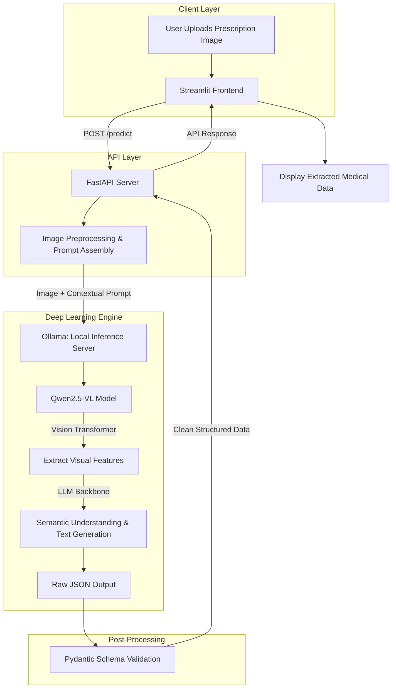

# 🏥 Medical Prescription Analyzer


> **An intelligent Vision-Language Model (VLM) pipeline designed to digitize, interpret, and structure handwritten medical prescriptions with high accuracy.**

## 📖 Overview

The **Medical Prescription Analyzer** solves a critical healthcare challenge: deciphering handwritten medical prescriptions. By leveraging state-of-the-art local Vision-Language Models, this tool seamlessly reads scanned or photographed prescriptions and extracts vital medicine data (such as dosage, duration, and frequency) into a structured JSON format. 

This project is tailored for pharmacists, healthcare providers, and patients to minimize medication errors and streamline digital health record keeping.

---

## 🧠 Deep Learning at the Core

**Yes, this is an Applied Deep Learning project!** 
Unlike basic tutorials that teach you to build simple neural networks from scratch, this project focuses on **Multimodal AI Engineering**—the art of deploying massive, pre-trained Deep Learning models to solve complex, real-world problems.

### How the Deep Learning Works Here:
1. **Multimodal Vision-Language Modeling (VLM):** The core engine is **Qwen2.5-VL**, a sophisticated deep learning model that bridges Computer Vision (CV) and Natural Language Processing (NLP).
2. **Visual Encoding (CV):** When a prescription image is uploaded, the model's Vision Transformer (ViT) layers break the image down into patches, extracting visual features like the strokes of handwritten text.
3. **Language Decoding (NLP):** These visual features are passed into a Large Language Model (LLM) backbone. The LLM understands the medical context (e.g., that "1-0-1" means morning and night) and translates the visual scribbles into coherent textual data.
4. **Zero-Shot / Few-Shot Prompting:** The model is heavily guided by optimized prompt engineering to bypass traditional OCR limitations. Instead of just reading text line-by-line, the deep learning model actually *understands* the layout and semantics of a prescription, structuring it directly into JSON.

---

## ✨ Key Features
- **Applied Deep Learning:** Uses state-of-the-art VLM inference via Ollama.
- **Context-Aware Handwriting Recognition:** Instead of raw OCR, the model infers clinical handwriting by understanding medical context.
- **Structured Data Extraction:** Automatically parses unstructured images into standard JSON format.
- **FastAPI Backend & Streamlit Frontend:** A complete full-stack wrapper around the deep learning engine.
- **Local & Secure Data Processing:** AI inference runs entirely on local hardware, ensuring patient data privacy.

---

## 🏗️ Detailed Architecture & Deep Learning Pipeline

The project follows an **Inference Pipeline Architecture**, separating the heavy Deep Learning computation from the client-facing UI.



### The Workflow Pipeline
1. **Ingestion:** The user uploads a JPEG/PNG image of a prescription via the Streamlit UI.
2. **API Routing:** The image is sent to the FastAPI backend, which handles asynchronous requests and validates the payload.
3. **Prompt Engineering:** The backend constructs a highly specific prompt instructing the VLM to act as a medical transcriptionist and output *only* valid JSON.
4. **VLM Inference (The Deep Learning Step):** The image and prompt are piped into the local Ollama instance running Qwen2.5-VL. The model performs billions of matrix multiplications, "reading" the visual tokens and generating contextual text tokens.
5. **Schema Validation:** The raw output is caught by FastAPI and validated using Pydantic to ensure it meets the strict schema requirements (e.g., ensuring `medicines` is a list, `dosage` is a string).
6. **Rendering:** The validated JSON is sent back to the Streamlit UI and presented in a clean, readable dashboard.


---

## 🚀 Quick Start Guide

### Prerequisites
- Python 3.11 or higher
- [Ollama](https://ollama.com/) installed and running on your machine
- Pull the required VLM model using Ollama:
  ```bash
  ollama pull qwen2.5vl
  ```

### 1. Setup Environment
Clone the repository and install dependencies:
```bash
git clone https://github.com/DYNAMOatGHUB/Medical-Prescription-Analyzer.git
cd Medical-Prescription-Analyzer

# Create and activate virtual environment
python -m venv venv
# On Windows:
venv\Scripts\activate
# On Linux/Mac:
source venv/bin/activate

# Install requirements
pip install -r requirements.txt
```

### 2. Run the Application
The application consists of two components: the backend API and the frontend dashboard. Run them in separate terminals.

**Terminal 1 – Start the Backend Server:**
```bash
python -m uvicorn app.main:app --reload
```
*The API will be available at `http://localhost:8000` (Visit `http://localhost:8000/docs` for Swagger UI).*

**Terminal 2 – Start the Frontend Dashboard:**
```bash
python -m streamlit run frontend/streamlit_app.py
```
*The dashboard will automatically open in your default browser at `http://localhost:8501`.*

---

## 📂 Project Structure

```text
Medical-Prescription-Analyzer/
├── app/
│   ├── __init__.py
│   ├── config.py              # Environment and configuration settings
│   ├── main.py                # FastAPI routing and application entry point
│   └── pipeline/
│       ├── __init__.py
│       └── vlm_extractor.py   # Ollama integration and VLM prompt engineering
├── frontend/
│   └── streamlit_app.py       # Streamlit UI implementation
├── tests/
│   └── __init__.py
├── .env                       # Runtime configuration (VLM_MODEL, LOG_LEVEL)
├── requirements.txt           # Project dependencies
└── README.md                  # Project documentation
```

---

## 🔌 API Reference

### `POST /predict`
Processes an uploaded prescription image and returns extracted medical data.

**Request:**
- `file`: The prescription image file (JPEG, PNG).

**Response:**
```json
{
  "filename": "prescription.jpg",
  "processing_time_seconds": 12.5,
  "prescription": {
    "medicines": [
      {
        "name": "Tab. Amoxicillin",
        "dosage": "500mg",
        "quantity": null,
        "period_of_intake": "1-0-1 (Morning, Night)",
        "route": "Oral",
        "duration": "5 days",
        "instructions": "After food"
      }
    ],
    "doctor_notes": "Review after 5 days"
  }
}
```

---

## 🛠️ Tech Stack

| Component | Technology | Description |
|-----------|------------|-------------|
| **AI Model** | Qwen2.5-VL via Ollama | Open-source Multimodal Vision-Language Model |
| **Backend** | FastAPI + Uvicorn | High-performance async Python web framework |
| **Frontend** | Streamlit | Rapid prototyping UI framework for data apps |
| **Validation** | Pydantic v2 | Robust data validation and schema enforcement |

---

## 🔮 Future Scope
- **Multi-language Support:** Extrapolating the VLM prompts to handle prescriptions in regional languages.
- **Database Integration:** Saving processed prescriptions to PostgreSQL/MongoDB for patient history tracking.
- **Drug Interaction Checker:** Integrating with external medical APIs to warn against contradictory medicines.
